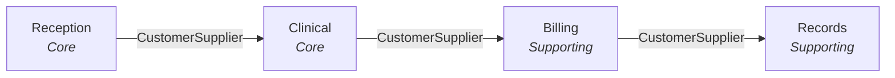
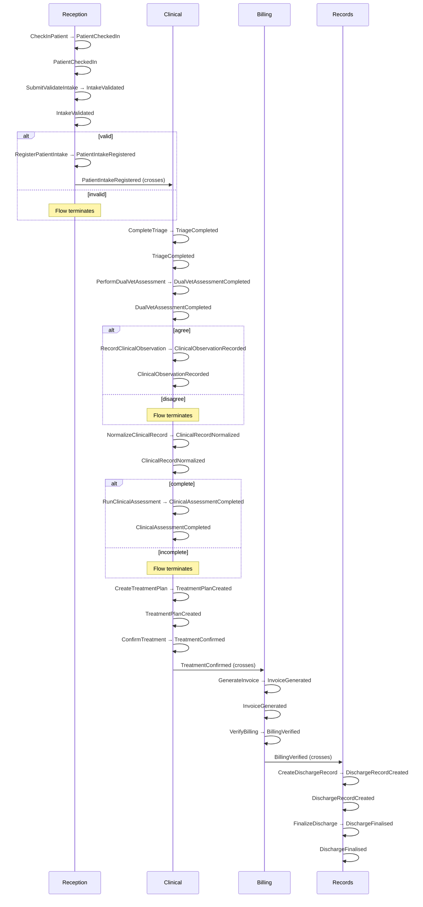

# Pet owner arrives for a scheduled appointment

> Pet owner arrives for a scheduled appointment. Full lifecycle through check-in, triage, diagnosis, treatment, billing, and discharge.

---

## Table of Contents

1. [At a Glance](#at-a-glance)
2. [What Happens](#what-happens)
3. [Context Boundaries](#context-boundaries)
4. [Domain Model](#domain-model)
5. [Data Glossary](#data-glossary)

## At a Glance

| Context | Role | Description | Aggregates | Commands | Events |
|---------|------|-------------|:----------:|:--------:|:------:|
| **Reception** | Core | Manages patient check-in, intake validation, and registration for veterinary visits | 1 | 3 | 3 |
| **Clinical** | Core | Handles triage, diagnosis, clinical assessment, and treatment planning for patient visits | 2 | 7 | 7 |
| **Billing** | Supporting | Generates invoices and verifies billing after treatment is confirmed | 1 | 2 | 2 |
| **Records** | Supporting | Creates and finalizes discharge records after billing verification | 1 | 2 | 2 |

**1 flow** · 14 moments · 3 context crossings · 7 business rules · 6 policies

## What Happens

**1. Patient check-in** *(Reception)*

  - *Requires:* Patient must have a scheduled appointment
  - Reception performs **CheckInPatient** → produces **PatientCheckedIn**
  - Reception emits **PatientCheckedIn**
  - 📋 *Rule REC-01:* Patient must have valid identification
  - 📋 *Rule REC-02:* Intake form must pass completeness validation

**2. Intake validation** *(Reception)*

  - *Requires:* Intake form must be fully completed
  - Reception performs **SubmitValidateIntake** → produces **IntakeValidated**
  - Reception emits **IntakeValidated**
  - 📋 *Rule REC-01:* Patient must have valid identification
  - 📋 *Rule REC-02:* Intake form must pass completeness validation

**3. Intake validation outcome** *(Reception)*

  - ✅ **If valid:**
    - Reception performs **RegisterPatientIntake** → produces **PatientIntakeRegistered**
    - **PatientIntakeRegistered** → crosses to **Clinical**
  - ❌ **If invalid** → flow terminates

**4. Triage** *(Clinical)*

  - *Requires:* Patient must be registered through intake
  - Clinical performs **CompleteTriage** → produces **TriageCompleted**
  - Clinical emits **TriageCompleted**
  - 🔗 *Policy: AssessOnTriageCompleted* — Initiate dual-vet assessment after triage
  - 📋 *Rule CLN-01:* Triage must be completed before diagnosis
  - 📋 *Rule CLN-02:* Dual-vet assessment must agree before proceeding

**5. Dual-vet assessment** *(Clinical)*

  - Clinical performs **PerformDualVetAssessment** → produces **DualVetAssessmentCompleted**
  - Clinical emits **DualVetAssessmentCompleted**
  - 📋 *Rule CLN-01:* Triage must be completed before diagnosis
  - 📋 *Rule CLN-02:* Dual-vet assessment must agree before proceeding

**6. Assessment agreement** *(Clinical)*

  - ✅ **If agree:**
    - Clinical performs **RecordClinicalObservation** → produces **ClinicalObservationRecorded**
    - Clinical emits **ClinicalObservationRecorded**
  - ❌ **If disagree** → flow terminates

**7. Clinical record normalization** *(Clinical)*

  - *Requires:* Clinical observation must be recorded
  - Clinical performs **NormalizeClinicalRecord** → produces **ClinicalRecordNormalized**
  - Clinical emits **ClinicalRecordNormalized**
  - 📋 *Rule CLN-01:* Triage must be completed before diagnosis
  - 📋 *Rule CLN-02:* Dual-vet assessment must agree before proceeding

**8. Records completeness check** *(Clinical)*

  - ✅ **If complete:**
    - Clinical performs **RunClinicalAssessment** → produces **ClinicalAssessmentCompleted**
    - Clinical emits **ClinicalAssessmentCompleted**
  - ❌ **If incomplete** → flow terminates

**9. Treatment planning** *(Clinical)*

  - *Requires:* Clinical assessment must be completed
  - Clinical performs **CreateTreatmentPlan** → produces **TreatmentPlanCreated**
  - Clinical emits **TreatmentPlanCreated**
  - 📋 *Rule CLN-03:* Treatment plan requires confirmed diagnosis

**10. Treatment confirmation** *(Clinical)*

  - *Requires:* Treatment plan must exist
  - Clinical performs **ConfirmTreatment** → produces **TreatmentConfirmed**
  - **TreatmentConfirmed** → crosses to **Billing**
  - 🔗 *Policy: BillOnVisitComplete* — Generate invoice after treatment is confirmed
  - 📋 *Rule CLN-03:* Treatment plan requires confirmed diagnosis

**11. Invoice generation** *(Billing)*

  - *Requires:* Visit must be marked complete
  - Billing performs **GenerateInvoice** → produces **InvoiceGenerated**
  - Billing emits **InvoiceGenerated**
  - 📋 *Rule BIL-01:* Invoice total must match sum of line items

**12. Billing verification** *(Billing)*

  - Billing performs **VerifyBilling** → produces **BillingVerified**
  - **BillingVerified** → crosses to **Records**
  - 🔗 *Policy: DischargeOnBilling* — Create discharge record after billing verification
  - 📋 *Rule BIL-01:* Invoice total must match sum of line items

**13. Discharge record creation** *(Records)*

  - Records performs **CreateDischargeRecord** → produces **DischargeRecordCreated**
  - Records emits **DischargeRecordCreated**
  - 📋 *Rule REC-03:* Discharge requires verified billing

**14. Discharge finalization** *(Records)*

  - *Requires:* Billing must be verified before discharge
  - Records performs **FinalizeDischarge** → produces **DischargeFinalised**
  - Records emits **DischargeFinalised**
  - 📋 *Rule REC-03:* Discharge requires verified billing

## Context Boundaries

These are the points where data crosses from one bounded context to another. Each crossing defines a contract — the required fields that the receiving context depends on.

### PatientIntakeRegistered

**Reception** → **Clinical** via CustomerSupplier
*Occurs during: Intake validation outcome*

| Field | Type | Required |
|-------|------|:--------:|
| `patientId` | UUID | ✓ |
| `name` | string | ✓ |
| `species` | string | ✓ |
| `ownerName` | string | ✓ |
| `appointmentType` | string | ✓ |

### TreatmentConfirmed

**Clinical** → **Billing** via CustomerSupplier
*Occurs during: Treatment confirmation*

| Field | Type | Required |
|-------|------|:--------:|
| `planId` | UUID | ✓ |
| `visitId` | UUID | ✓ |
| `patientId` | UUID | ✓ |

### BillingVerified

**Billing** → **Records** via CustomerSupplier
*Occurs during: Billing verification*

| Field | Type | Required |
|-------|------|:--------:|
| `invoiceId` | UUID | ✓ |
| `visitId` | UUID | ✓ |
| `patientId` | UUID | ✓ |

## Domain Model

### Reception [Core]

> Manages patient check-in, intake validation, and registration for veterinary visits

#### PatientIntake

*Identity:* `intakeId: UUID`

| Command | Purpose | Produces |
|---------|---------|----------|
| **CheckInPatient** | Patient must have a scheduled appointment | PatientCheckedIn |
| **SubmitValidateIntake** | Intake form must be fully completed | IntakeValidated |
| **RegisterPatientIntake** | Accepts validatedIntakeId, patientId | PatientIntakeRegistered |

**PatientCheckedIn:**
- `intakeId`: *UUID*
- `patientId`: *UUID*
- `ownerName`: *string*
- `appointmentType`: *string*
- `checkedInAt`: *DateTime*

**IntakeValidated:**
- `intakeId`: *UUID*
- `patientId`: *UUID*
- `validationResult`: *string*
- `validatedAt`: *DateTime*

**PatientIntakeRegistered:**
- `intakeId`: *UUID*
- `patientId`: *UUID*
- `name`: *string*
- `species`: *string*
- `breed`: *string*
- `ownerName`: *string*
- `appointmentType`: *string*
- `registeredAt`: *DateTime*

### Clinical [Core]

> Handles triage, diagnosis, clinical assessment, and treatment planning for patient visits

#### VisitRecord

*Identity:* `visitId: UUID`

| Command | Purpose | Produces |
|---------|---------|----------|
| **CompleteTriage** | Patient must be registered through intake | TriageCompleted |
| **PerformDualVetAssessment** | Accepts visitId, triageResults | DualVetAssessmentCompleted |
| **RecordClinicalObservation** | Accepts visitId, diagnosis, differentials, confidence | ClinicalObservationRecorded |
| **NormalizeClinicalRecord** | Clinical observation must be recorded | ClinicalRecordNormalized |
| **RunClinicalAssessment** | Accepts visitId, recordId, patientId | ClinicalAssessmentCompleted |

**TriageCompleted:**
- `visitId`: *UUID*
- `patientId`: *UUID*
- `weight`: *string*
- `temperature`: *string*
- `heartRate`: *string*
- `chiefComplaint`: *string*
- `urgency`: *string*
- `completedAt`: *DateTime*

**DualVetAssessmentCompleted:**
- `visitId`: *UUID*
- `agreement`: *boolean*
- `assessedAt`: *DateTime*

**ClinicalObservationRecorded:**
- `visitId`: *UUID*
- `observationId`: *UUID*
- `patientId`: *UUID*
- `diagnosis`: *string*
- `differentials`: *string[]*
- `confidence`: *number*
- `recordedAt`: *DateTime*

**ClinicalRecordNormalized:**
- `visitId`: *UUID*
- `recordId`: *UUID*
- `patientId`: *UUID*
- `symptoms`: *string[]*
- `vitalSigns`: *VitalSigns*
- `vaccinationStatus`: *string*
- `classification`: *string*
- `normalizedAt`: *DateTime*

**ClinicalAssessmentCompleted:**
- `visitId`: *UUID*
- `assessmentResult`: *string*
- `completedAt`: *DateTime*

#### TreatmentPlan

*Identity:* `planId: UUID`

| Command | Purpose | Produces |
|---------|---------|----------|
| **CreateTreatmentPlan** | Clinical assessment must be completed | TreatmentPlanCreated |
| **ConfirmTreatment** | Treatment plan must exist | TreatmentConfirmed |

**TreatmentPlanCreated:**
- `planId`: *UUID*
- `visitId`: *UUID*
- `patientId`: *UUID*
- `diagnosis`: *string*
- `medications`: *Medication[]*
- `instructions`: *string*
- `createdAt`: *DateTime*

**TreatmentConfirmed:**
- `planId`: *UUID*
- `confirmedBy`: *string*
- `rationale`: *string*
- `confirmedAt`: *DateTime*

**Sagas:**

- **VisitLifecycle**: Triaging → Diagnosing → Cataloging → Treating → Complete
  - Triggered by: PatientIntakeRegistered
  - Compensation: Cancel visit and release appointment slot

### Billing [Supporting]

> Generates invoices and verifies billing after treatment is confirmed

#### Invoice

*Identity:* `invoiceId: UUID`

| Command | Purpose | Produces |
|---------|---------|----------|
| **GenerateInvoice** | Visit must be marked complete | InvoiceGenerated |
| **VerifyBilling** | Accepts invoiceId | BillingVerified |

**InvoiceGenerated:**
- `invoiceId`: *UUID*
- `visitId`: *UUID*
- `patientId`: *UUID*
- `lineItems`: *LineItem[]*
- `total`: *Money*
- `currency`: *string*
- `generatedAt`: *DateTime*

**BillingVerified:**
- `invoiceId`: *UUID*
- `verifiedAt`: *DateTime*

### Records [Supporting]

> Creates and finalizes discharge records after billing verification

#### DischargeRecord

*Identity:* `dischargeId: UUID`

| Command | Purpose | Produces |
|---------|---------|----------|
| **CreateDischargeRecord** | Accepts visitId, patientId, planId, invoiceId | DischargeRecordCreated |
| **FinalizeDischarge** | Billing must be verified before discharge | DischargeFinalised |

**DischargeRecordCreated:**
- `dischargeId`: *UUID*
- `visitId`: *UUID*
- `patientId`: *UUID*
- `createdAt`: *DateTime*

**DischargeFinalised:**
- `dischargeId`: *UUID*
- `finalisedAt`: *DateTime*

## Data Glossary

Shared data structures used across the domain:

**AppointmentDetails**

| Field | Type |
|-------|------|
| `appointmentId` | UUID |
| `scheduledAt` | DateTime |
| `appointmentType` | string |
| `veterinarianId` | UUID |

**TriageResults**

| Field | Type |
|-------|------|
| `weight` | string |
| `temperature` | string |
| `heartRate` | string |
| `chiefComplaint` | string |
| `urgency` | string |

**VitalSigns**

| Field | Type |
|-------|------|
| `weight` | string |
| `temperature` | string |
| `heartRate` | string |

**Medication**

| Field | Type |
|-------|------|
| `name` | string |
| `dose` | string |
| `frequency` | string |

**LineItem**

| Field | Type |
|-------|------|
| `label` | string |
| `amount` | Money |

---

*Generated by [Moment](https://github.com/mmmnt/mmmnt) from 4 contexts and 1 flow.*
